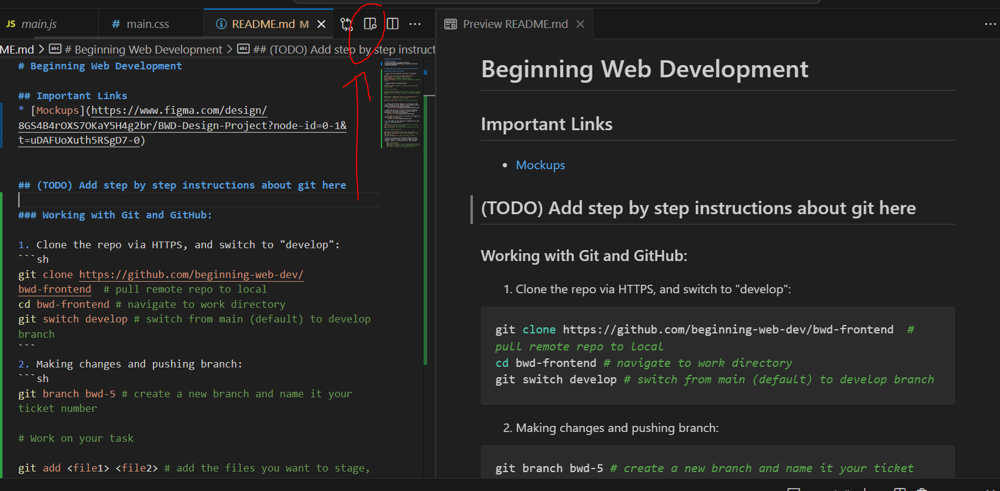
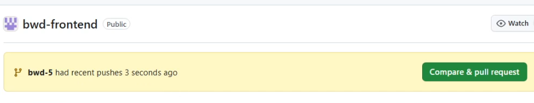
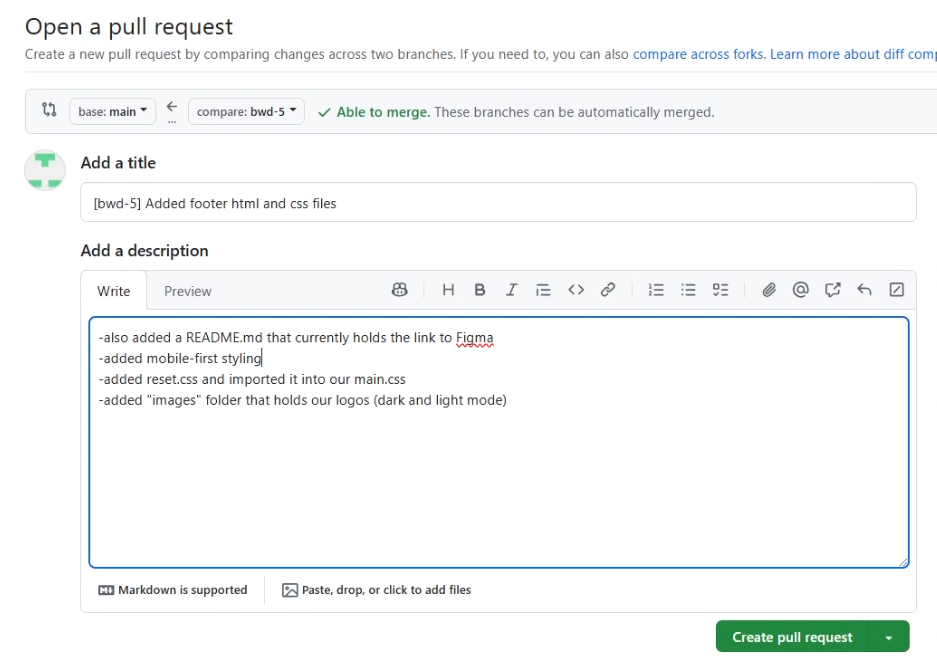
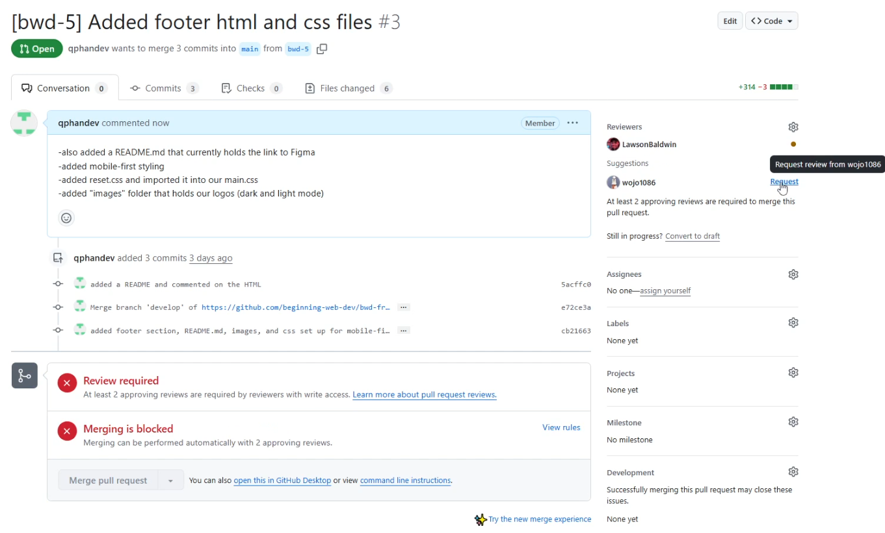

# Beginning Web Development 
(TODO: Add brief description of this repo here)

**NOTE TO DEVS**: if you're working in VSCode, reading the following might be hard and you wouldn't see the embedded images. Click the indicated button to open preview for a cleaner format (usually at the upper right corner of the screen, it's a square icon with a magnifying glass at its bottom right):


## Important Links
* [Figma Mockups](https://www.figma.com/design/8GS4B4rOXS7OKaY5H4g2br/BWD-Design-Project?node-id=0-1&t=uDAFUoXuth5RSgD7-0)


## Working with Git and GitHub:

1. Clone the repo via HTTPS, and switch to "develop":
```sh
git clone https://github.com/beginning-web-dev/bwd-frontend  # pull remote repo to local
cd bwd-frontend # navigate to work directory
git switch develop # switch from main (default) to develop branch
```
2. Making changes and pushing branch:
```sh
git branch bwd-5 # create a new branch and name it your ticket number

# work on your task then stage, commit, and push your work...

git add <file1> <file2> # add the files you want to stage, alternatively you could do 'git add .' to add all modified files

git commit -m "added html and css for footersection" # commit your staged files with a message

git push origin bwd-5 # push your files up as a branch
```

3. Creating the PR (Pull Request) by navigating on the repo on GitHub and click "Compare & pull request" https://github.com/beginning-web-dev/bwd-frontend
    

4. Rename the title as [ticketNum] (brief description), then you can add specific details to the box under if appropriate. List them as bulletpoints.
    

5. Your code is up for review! You should click request to notice people to review it.
    

6. If you happen to have requests to change parts of your code, it's the same process:
```sh
git branch # check you're on the right branch, in this case I expect this to return bwd-5
git switch bwd-5 # go to the branch currently up for PR

# address comments and fixes

git add <file1> <file2> # stage files with changes
git commit -m "addressed issues from reviewers" # commit and add message
git push origin bwd-5 # update the branch with PR
```
7. Once you've passed review, code approved, and your branch has been merged to "develop" branch, you need to update your local "develop" branch. It's good practice to stay updated!
```sh
    git switch develop 
    git pull # your local develop branch is synced up with the remote branch now!
    git branch -d bwd-5 # if you've completed the task at this point, you remove that branch to clean up
```